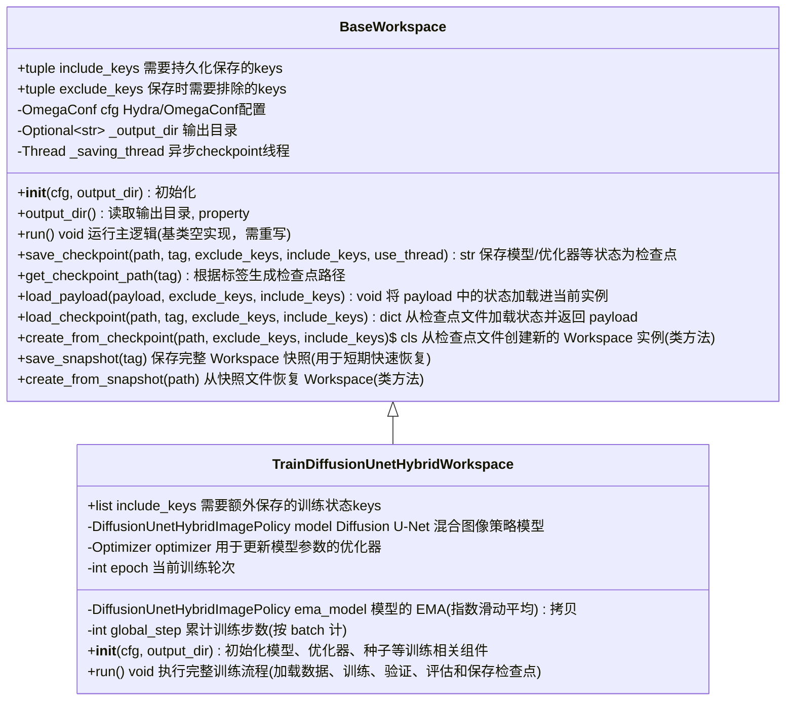

# Workspace

```mermaid
classDiagram
    BaseWorkspace <|-- TrainDiffusionUnetHybridWorkspace
    
    class BaseWorkspace {
        +tuple include_keys  需要持久化保存的keys
        +tuple exclude_keys  保存时需要排除的keys
        -OmegaConf cfg  Hydra/OmegaConf配置
        -Optional~str~ _output_dir  输出目录
        -Thread _saving_thread  异步checkpoint线程
        
        +__init__(cfg, output_dir)  初始化
        +output_dir() 读取输出目录, property  
        +run() void  运行主逻辑(基类空实现，需重写)
        +save_checkpoint(path, tag, exclude_keys, include_keys, use_thread) str  保存模型/优化器等状态为检查点
        +get_checkpoint_path(tag) 根据标签生成检查点路径
        +load_payload(payload, exclude_keys, include_keys) void  将 payload 中的状态加载进当前实例
        +load_checkpoint(path, tag, exclude_keys, include_keys) dict  从检查点文件加载状态并返回 payload
        +create_from_checkpoint(path, exclude_keys, include_keys)$ cls  从检查点文件创建新的 Workspace 实例(类方法)
        +save_snapshot(tag) 保存完整 Workspace 快照(用于短期快速恢复)
        +create_from_snapshot(path) 从快照文件恢复 Workspace(类方法)
    }
    
    class TrainDiffusionUnetHybridWorkspace {
        +list include_keys  需要额外保存的训练状态keys
        -DiffusionUnetHybridImagePolicy model  Diffusion U-Net 混合图像策略模型
        -DiffusionUnetHybridImagePolicy ema_model  模型的 EMA(指数滑动平均)拷贝
        -Optimizer optimizer  用于更新模型参数的优化器
        -int global_step  累计训练步数(按 batch 计)
        -int epoch  当前训练轮次
        
        +__init__(cfg, output_dir)  初始化模型、优化器、种子等训练相关组件
        +run() void  执行完整训练流程(加载数据、训练、验证、评估和保存检查点)
    }
```